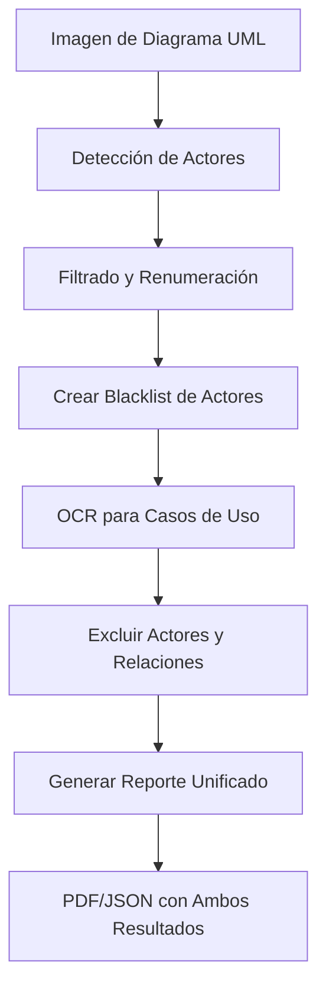

# Modelo OpenCV-OCR - Actor and Use Case Detection API

Este repositorio contiene un sistema completo para la **detección de actores y casos de uso en diagramas UML de casos de uso** y extracción de texto asociado mediante **OCR (EasyOCR)**. El sistema incluye tanto el pipeline de procesamiento de imágenes como una API RESTful construida con FastAPI para generar reportes en PDF con los resultados.

---

### ✨ Características:
- **Detección dual**: Actores + Casos de uso en un solo procesamiento
- **Blacklist inteligente**: Los actores detectados se usan para excluir falsos positivos en OCR
- **PDF mejorados**: Reportes combinados con ambas secciones
- **Exclusión de relaciones UML**: Filtrado automático de `<<include>>`, `<<extend>>`, etc.

### 🔄 Flujo de Trabajo Mejorado:
1. **Detección de actores** → Filtrado → Blacklist
2. **OCR con exclusión** → Solo casos de uso válidos
3. **Reporte unificado** → Actores + Casos de uso en un solo documento

---

## 📁 Archivos principales

| Archivo | Descripción |
|---------|-------------|
| `actor_detector.py` | Script principal para la detección de actores y extracción de texto. Implementa todo el pipeline de procesamiento de imágenes, detección de cabezas y OCR. |
| `usecase_ocr.py` | Módulo especializado en detección de casos de uso, excluyendo actores detectados y relaciones UML. |
| `main.py` | Aplicación FastAPI que expone endpoints REST para procesar imágenes y generar reportes PDF. |
| `pdf_builder.py` | Módulo para la generación de reportes PDF profesionales con actores y casos de uso. |

---

## 🔧 Pipeline de Detección Completo

### 📊 Flujo de Procesamiento Mejorado:



### 1. Detección de Actores (`actor_detector.py`)

Mantiene todas las funcionalidades originales:
- **Preprocesamiento**: Conversión a escala de grises, inversión, umbralización
- **Template matching**: Detección de figuras de actores
- **Verificación de cabeza**: HoughCircles para validación geométrica
- **OCR de texto**: Extracción de nombres de actores

### 2. Detección de Casos de Uso (`usecase_ocr.py`)

**Nuevo módulo especializado**:
- **Blacklist automática**: Usa nombres de actores detectados para excluir falsos positivos
- **Filtrado de relaciones UML**: Excluye automáticamente `<<include>>`, `<<extend>>`, etc.
- **OCR configurable**: Umbral de confianza ajustable
- **Resultados estructurados**: JSON con detalles de cada caso de uso detectado

### 3. Generación de Reportes (`pdf_builder.py`)

**Funcionalidades extendidas**:
- **Reportes combinados**: Actores + Casos de uso en un solo PDF
- **Múltiples formatos**: Completo, simple y compacto
- **Estadísticas integradas**: Conteos de ambas detecciones
- **Diseño profesional**: Tablas formateadas y secciones claras

---

## 🌐 API REST - FastAPI

### Endpoints Disponibles

| Método | Endpoint | Descripción | Parámetros |
|--------|----------|-------------|------------|
| `GET` | `/` | Información de la API | - |
| `GET` | `/health` | Verificación del estado del servicio | - |
| `POST` | `/detect-actors/` | Procesa imagen y devuelve actores + casos de uso | `file`, `debug`, `format`, `ocr_confidence` |
| `POST` | `/detect-actors-simple/` | Versión simplificada para PDF | `file`, `ocr_confidence` |
| `GET` | `/example-actors/` | Genera PDF de ejemplo sin subir imagen | - |

### Parámetros Nuevos

| Parámetro | Tipo | Descripción | Valor por Defecto |
|-----------|------|-------------|-------------------|
| `ocr_confidence` | float | Umbral de confianza para OCR de casos de uso (0.1-1.0) | 0.3 |
| `format` | string | Formato de salida: `pdf`, `json`, `compact-pdf` | `pdf` |

### Ejemplos de Uso

```bash
# Detección completa con confianza personalizada
curl -X POST "http://localhost:8000/detect-actors/?ocr_confidence=0.4" \
  -F "file=@diagrama.png" \
  -o reporte_completo.pdf

# Formato JSON con todos los datos
curl -X POST "http://localhost:8000/detect-actors/?format=json" \
  -F "file=@diagrama.png" \
  -H "accept: application/json"

# Versión simple solo para PDF
curl -X POST "http://localhost:8000/detect-actors-simple/?ocr_confidence=0.5" \
  -F "file=@diagrama.png" \
  -o resultados_simples.pdf
```

---

## 📄 Formatos de Salida

### 1. PDF Completo (`/detect-actors/`)

**Estructura del reporte**:
```
REPORTE DE ANÁLISIS DE DIAGRAMA UML
════════════════════════════════════

Resumen del Análisis:
• Actores detectados: 4
• Casos de uso detectados: 6

ACTORES DETECTADOS:
┌─────┬──────────────────────┐
│ ID  │ Nombre del Actor     │
├─────┼──────────────────────┤
│ A1  │ Cliente              │
│ A2  │ Sistema de Pagos     │
│ A3  │ Administrador        │
│ A4  │ Base de Datos        │
└─────┴──────────────────────┘

CASOS DE USO DETECTADOS:
┌─────┬────────────────────────────────────┐
│ ID  │ Descripción del Caso de Uso        │
├─────┼────────────────────────────────────┤
│ 1   │ Realizar compra en línea           │
│ 2   │ Consultar historial de pedidos     │
│ 3   │ Generar reporte mensual            │
│ 4   │ Configurar preferencias            │
│ 5   │ Actualizar información             │
│ 6   │ Verificar disponibilidad           │
└─────┴────────────────────────────────────┘
```

### 2. PDF Simple (`/detect-actors-simple/`)

**Estructura simplificada**:
```
RESULTADOS DEL ANÁLISIS

Actores identificados: 4 | Casos de uso: 6

Actores:
Actor 1: Cliente
Actor 2: Sistema de Pagos
Actor 3: Administrador
Actor 4: Base de Datos

Casos de Uso:
1. Realizar compra en línea
2. Consultar historial de pedidos
3. Generar reporte mensual
4. Configurar preferencias
5. Actualizar información
6. Verificar disponibilidad
```

### 3. JSON Response

```json
{
  "status": "success",
  "detection_time": "2024-01-15T10:30:45",
  "statistics": {
    "total_actors_detected": 5,
    "actors_with_names": 4,
    "actors_without_names": 1,
    "use_cases_detected": 6,
    "actors_in_final_report": 4
  },
  "actors": [
    {"actor_id": 1, "name": "Usuario del Sistema"},
    {"actor_id": 2, "name": "Administrador"},
    {"actor_id": 3, "name": "Sistema de Pagos"},
    {"actor_id": 4, "name": "Base de Datos"}
  ],
  "use_cases": [
    {"use_case_id": 1, "description": "Iniciar sesión en el sistema"},
    {"use_case_id": 2, "description": "Realizar pago en línea"},
    {"use_case_id": 3, "description": "Consultar historial"},
    {"use_case_id": 4, "description": "Generar reporte mensual"},
    {"use_case_id": 5, "description": "Configurar preferencias"},
    {"use_case_id": 6, "description": "Actualizar información"}
  ]
}
```

---

## ⚙️ Configuración Técnica

### Dependencias Actualizadas

```bash
pip install fastapi[standard] python-multipart reportlab opencv-python numpy easyocr Pillow uvicorn
```

### Estructura del Proyecto

```
project/
├── main.py              # Aplicación FastAPI
├── actor_detector.py    # Lógica de detección de actores
├── usecase_ocr.py       # Detección de casos de uso (NUEVO)
├── pdf_builder.py       # Generación de PDFs (MEJORADO)
├── requirements.txt     # Dependencias actualizadas
├── tmp/                 # Archivos temporales subidos
└── README.md           # Documentación actualizada
```

### Variables de Configuración

| Variable | Descripción | Valor Recomendado |
|----------|-------------|-------------------|
| `ocr_confidence` | Sensibilidad del OCR para casos de uso | 0.3-0.5 |
| `debug` | Generar imágenes de depuración | `false` (producción) |
| `gpu` | Usar GPU para OCR | `false` (CPU por defecto) |
| `include_empty` | Incluir actores sin nombre en JSON | `false` |

---

## 🔍 Estrategias de Filtrado Mejoradas

### 1. Blacklist de Actores
- **Extracción automática**: Los nombres de actores detectados se añaden automáticamente
- **Coincidencia inteligente**: Búsqueda parcial y exacta
- **Case-insensitive**: No distingue mayúsculas/minúsculas

### 2. Exclusión de Relaciones UML
**Patrones excluidos automáticamente**:
- `<<include>>`, `<<extend>>`
- `<<includes>>`, `<<extends>>`
- `include`, `extend` (en contexto UML)
- Variaciones con diferentes símbolos

### 3. Filtrado por Confianza
- **Umbral configurable**: `ocr_confidence` (0.1-1.0)
- **Texto corto ignorado**: Menos de 3 caracteres
- **Detección multilingüe**: Español e inglés

---

## 📊 Ejemplos de Resultados

### Caso de Éxito Típico

**Entrada**: Diagrama UML con 4 actores y 8 casos de uso
**Procesamiento**:
- Actores detectados: 4/4 (100%)
- Casos de uso detectados: 6/8 (75%)
- Relaciones excluidas: `<<include>>`, `<<extend>>` (100%)

**Salida**: Reporte PDF con ambas secciones completas

### Manejo de Falsos Positivos

El sistema evita:
1. **Nombres de actores como casos de uso**
2. **Relaciones UML en el texto**
3. **Texto irrelevante o ruido**
4. **Elementos de diagrama no relevantes**

---

## 🚨 Manejo de Errores

### Casos Comunes y Soluciones

| Error | Causa Probable | Solución |
|-------|---------------|----------|
| "No se detectaron actores" | Diagrama muy complejo o atípico | Ajustar umbrales de template matching |
| "Casos de uso incorrectos" | OCR confunde elementos | Aumentar `ocr_confidence` |
| "Falsos positivos en casos de uso" | Blacklist incompleta | Verificar detección de actores |
| "PDF sin imágenes" | Modo debug desactivado | Usar `debug=true` |

### Modo Debug

Activar con `debug=true` para obtener:
- `actors_debug_output.png` - Imagen con anotaciones
- `usecases_results.json` - Resultados detallados de OCR
- ROIs individuales por actor y caso de uso

---

## 📈 Mejoras Futuras

### En Desarrollo:
- [ ] Soporte para más tipos de diagramas UML
- [ ] Reconocimiento de flechas y conectores
- [ ] Exportación a formatos adicionales (Excel, CSV)
- [ ] Interfaz web para carga visual

### Características Planeadas:
- [ ] Análisis de relaciones actor-caso de uso
- [ ] Validación de coherencia del diagrama
- [ ] Sugerencias de mejoras en el diseño
- [ ] Integración con herramientas UML populares

---

## 📚 Referencias Técnicas

### Tecnologías Utilizadas
- **OpenCV**: Procesamiento de imágenes y detección de patrones
- **EasyOCR**: Reconocimiento óptico de caracteres
- **FastAPI**: Framework web moderno y rápido
- **ReportLab**: Generación de PDFs programática
- **NumPy**: Operaciones numéricas eficientes

### Algoritmos Implementados
1. **Template Matching**: Para localización de actores
2. **Hough Transform**: Para detección de círculos (cabezas)
3. **Umbralización adaptativa**: Para preprocesamiento
4. **Filtrado por blacklist**: Para exclusión inteligente

---

## 🤝 Contribuciones

Las contribuciones son bienvenidas en las siguientes áreas:

1. **Mejora de precisión**: Nuevos algoritmos de detección
2. **Soporte adicional**: Más tipos de diagramas UML
3. **Optimización**: Mejor rendimiento y eficiencia
4. **Documentación**: Ejemplos y tutoriales

### Cómo Contribuir:
1. Fork del repositorio
2. Crear rama de características (`git checkout -b feature/nueva-funcionalidad`)
3. Commit de cambios (`git commit -am 'Añadir nueva funcionalidad'`)
4. Push a la rama (`git push origin feature/nueva-funcionalidad`)
5. Crear Pull Request

---

## 📄 Licencia

Este proyecto está licenciado bajo los términos de la licencia MIT. Ver el archivo `LICENSE` para más detalles.

---

## ✉️ Contacto y Soporte

Para preguntas, problemas o sugerencias:
- **Issues**: Reportar en GitHub Issues
- **Documentación**: Consultar este README
- **Ejemplos**: Probar con el endpoint `/example-actors/`

---